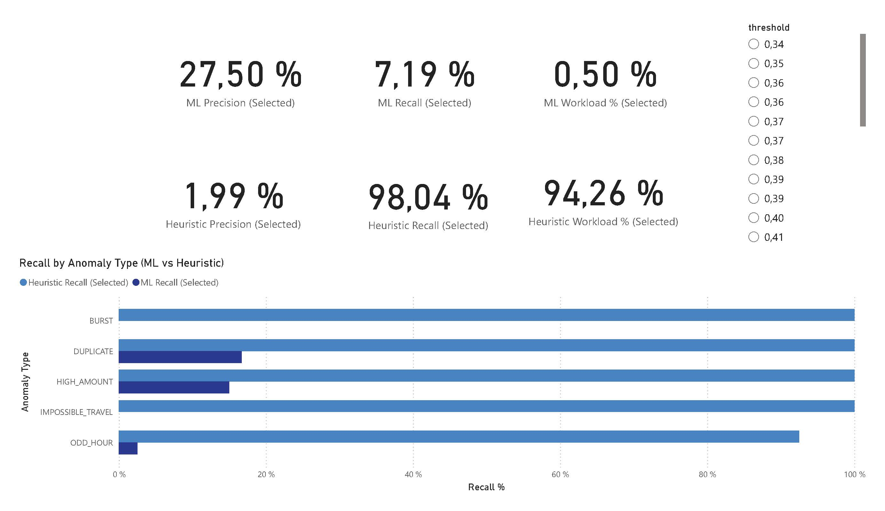
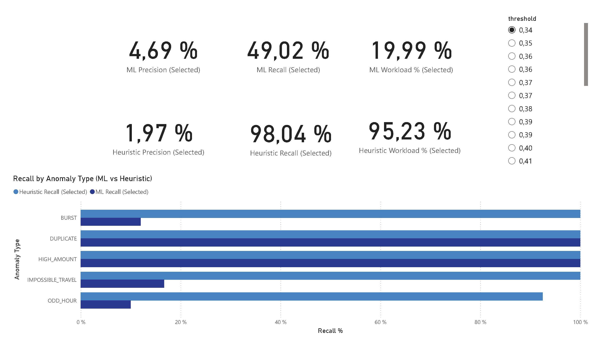
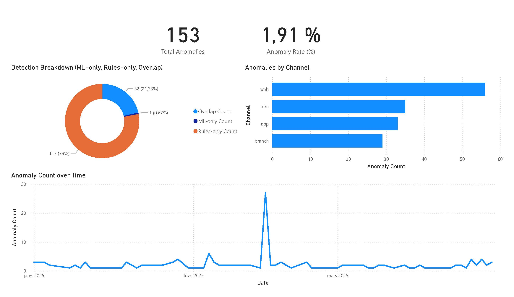

# Anomaly Analytics — Hybrid ML + Rules for Audit

A compact, reproducible pipeline that **generates transactional data**, **scores anomalies with ML (Isolation Forest)**, **adds auditable business rules**, and **exports clean tables for Power BI**. It’s designed to show how I approach **audit & digital assurance** with a pragmatic **ML + IT** mindset: engineered features, cost-aware thresholds, explainable cases, and a clean export layer decoupled from the dashboard.

---

## What this project demonstrates

- **Hybrid detection**: unsupervised ML (Isolation Forest) + **explicit rules** for transparent coverage.
- **Cost-aware tuning**: threshold sweep with precision/recall, workload %, FPR, and **expected cost** (C_FP vs C_FN).
- **Explainability**: top-N **case sheets** with simple reasons (`amount_z`, `hour`, `new_country`, `merchant_novelty`) for auditors.
- **Reproducible exports**: one click/command creates a timestamped `exports/run_*` folder ready for **Power BI**.
- **Engineering quality**: clear `src/` package, centralized paths, environment override, CLI scripts, deterministic seeds.

---

## Repository structure

```bash
├─ src/
│ ├─ paths.py # project root, exports dir, run dir (timestamped)
│ ├─ export_utils.py # CSV/JSON writers for all artifacts
│ ├─ data_generator.py # synthetic data with injected anomaly types
│ └─ anomaly_detector.py # feature eng, rules, Isolation Forest, metrics, exports
├─ exports/ # auto-created; contains run_* subfolders
├─ run_exports_demo.py # optional launcher/orchestrator 
├─ dashboard_anomalies.pbix # Power BI dashboard
├─ environment.yml  # full conda environment
├─ requirements.txt # minimal pip fallback
└─ docs/img/ # screenshots for README 

```


---

## Quick start

### 1) Environment (conda)

```bash
conda env create -f environment.yml
conda activate anomalies
```
### 2) Generate a dataset

```bash
# either
python src/data_generator.py
# or (if src is a package in your PYTHONPATH)
python -m src.data_generator
```

Outputs:

```bash
exports/data_YYYY-MM-DD_HH-MM-SS/transactions_synth.csv
```


### 3) Train, score, apply rules, and export everything

```bash
# Use the latest generated dataset automatically:
python src/anomaly_detector.py --seed 42 --default_threshold 0.85

# Or point explicitly to a dataset:
python src/anomaly_detector.py \
  --data exports/data_*/transactions_synth.csv \
  --seed 42 --default_threshold 0.85
```
This creates:

```bash
exports/run_YYYY-MM-DD_HH-MM-SS/
  ├─ transactions_scored.csv   # each transaction with ML score, flags, reasons
  ├─ thresholds.csv            # sweep of thresholds with metrics (ML-only & Hybrid)
  ├─ metrics_by_type.csv       # precision/recall/F1 per anomaly type
  ├─ confusion_matrix.csv      # global confusion at the chosen default threshold
  └─ run.json                  # run metadata (paths, sizes, parameters)
```

## How it works (Python pipeline)

### A) Data generation (`src/data_generator.py`)
Creates realistic synthetic payments with channels (`web`, `app`, `atm`, `branch`), categories, geos, timestamps, and injects labelled anomalies:

- **HIGH_AMOUNT** — extreme amounts  
- **ODD_HOUR** — suspicious night activity  
- **DUPLICATE** — fast duplicates on `(customer, amount, merchant_category)`  
- **BURST** — bursts in a short window  
- **IMPOSSIBLE_TRAVEL / NEW_COUNTRY** — improbable geolocation patterns  

Saves `transactions_synth.csv` in a timestamped `exports/data_*` folder.

---

### B) Feature engineering (`feature_engineering`)
Adds interpretable features for both ML and rules:

- Temporal: `hour`, `dayofweek`, `time_since_last` (per customer)  
- Amount scaling & context: `amount_log`, `amount_z` (per-customer z-score)  
- Behavioural: `merchant_novelty` (rare merchant for the customer)  

---

### C) Business rules (`apply_rules`)
Auditable heuristics:

- `rule_night_high_amount`: amount > 500 during 00:00–04:00  
- `rule_new_country`: first time a customer appears in a country  
- `rule_burst`: rolling 10-minute burst count per customer  
- `rule_travel`: simplified travel flag (e.g., country `CN` from generator)  
- `rule_duplicate`: same `(customer, amount, category)` within 5 minutes  

Aggregate to `is_rule_flag`.

---

### D) ML model (`fit_iforest`)
- **Isolation Forest** (unsupervised), `contamination≈0.025`  
- Score normalization to **0–1** (`score`)  
- ML flag via threshold: `is_ml_flag`  

---

### E) Hybrid decision & metrics
- Final decision: `is_flag = is_ml_flag OR is_rule_flag`  
- **Threshold sweep (`thresholds.csv`)**: precision, recall, FPR, workload %, and **expected cost** with `C_FP=1`, `C_FN=10`  
- Global confusion at a chosen `--default_threshold` (`confusion_matrix.csv`)  
- `metrics_by_type.csv` to see what types the system misses or over-flags  
- `cases.csv`: top-N alerts with `reasons_top3` and `triggered_rules` for reviewers  

---

## Power BI dashboard

Two pages fed only by the exported CSVs:

1. **Threshold / KPIs**  
   - Slicer: `threshold` (comes from `thresholds.csv`)  
   - KPIs: ML Precision/Recall/Workload %, Heuristic Precision/Recall/Workload %  
   - Bar chart: **Recall by Anomaly Type** (ML vs Heuristic)  

2. **Anomaly Volume & Trends**  
   - Cards: **Total Anomalies**, **Anomaly Rate %**  
   - Donut: detection breakdown (**ML-only**, **Rules-only**, **Overlap**)  
   - Bar: anomalies by **Channel**  
   - Line: **Anomaly Count over Time** (daily)  

The dashboard is intentionally simple and **auditor-friendly**: it separates *tuning* (page 1) from *operational monitoring* (page 2).


---

##  Results 

## Results 

**High threshold (low workload, higher precision)**


**Threshold high (≈ 0.77)**  
- **ML**: Precision **27.50%**, Recall **7.19%**, Workload **0.50%**  
- **Heuristic**: Precision **1.99%**, Recall **98.04%**, Workload **94.26%**  

At this level, the system is **very selective**: only the most obvious anomalies are flagged.  
This means:
- **Precision increases** → most ML alerts are relevant.  
- **Recall drops** → many anomalies go undetected.  
- **Workload is minimal** → only a tiny fraction of transactions are sent for review.  
This setup is useful when audit teams want to focus on **quality over quantity**, with very limited review capacity.

---

**Low threshold (higher recall, higher workload)**


**Threshold low (≈ 0.34)**  
- **ML**: Precision **4.69%**, Recall **49.02%**, Workload **19.99%**  
- **Heuristic**: Precision **1.97%**, Recall **98.04%**, Workload **95.23%**  

Here the model is **much more permissive**:  
- **Recall increases** significantly (almost half of true anomalies are caught by ML).  
- **Precision drops** sharply → many false positives enter the pipeline.  
- **Workload rises** → ~20% of transactions must be reviewed by humans.  
This setup favors **coverage and risk detection** over efficiency, which may overwhelm auditors.

---

**Volume breakdown and trends**


**Operational view**  
- **Total anomalies**: **153** (Rate **1.91%**)  
- Detection breakdown: mostly **Rules-only**, some **ML-only**, tiny **Overlap**  
- **Channel**: `web` generates the highest anomaly volume; followed by `atm`, `app`, then `branch`  
- **Trend**: one clear spike on **15 February** with **27 anomalies detected in a single day**, possibly linked to a **batch effect or unusual event**.  
  Outside of this spike, anomalies remain **stable and low** across the period.  

---

> **Takeaway**  
> - Rules provide **broad coverage (~98% recall)** but at the cost of **very high workload**.  
> - ML enables a **trade-off**: by tuning the threshold, you can decide between catching more anomalies (high recall, high workload) or focusing on fewer, higher-quality cases (high precision, low workload).  
> - The **hybrid approach** combines transparency (rules) with adaptability (ML), making it suitable for **audit environments** where efficiency and explainability are both critical.  


---

## Why this is ML + IT (my differentiator)

- **Modeling**: unsupervised Isolation Forest with behavioural features; calibrated via quantile-based thresholding and cost-aware selection.  
- **Explainability for audit**: per-type metrics + human-readable reasons on cases.  
- **Engineering for teams**: deterministic seeds, timestamped runs, `run.json` metadata, clean writers, env-overridable project root, CLI usage.  
- **Separation of concerns**: Python does the heavy lifting once; BI tools consume frozen exports — easy to refresh, easy to review.  

---

## Using the Power BI dashboard

You have two options:

1. **Open the PBIX file directly**  
   - Download the repository and open the included `dashboard_anomalies.pbix` in **Power BI Desktop**.  
   - The PBIX is already linked to the exported CSVs (`transactions_scored.csv`, `thresholds.csv`, `metrics_by_type.csv`, `confusion_matrix.csv`).  
   - As long as the folder structure is preserved, everything works out of the box. If needed, you can easily re-point the sources to the CSVs provided.  

2. **Rebuild from scratch (optional)**  
   - In Power BI Desktop: **Get Data → Text/CSV** and connect manually to the 4 files above.  
   - Create a simple star-like model (no complex relationships needed).  
   - Use `thresholds[threshold]` as a slicer 
   - Bind KPIs to the selected threshold row (ML vs Heuristic) and recreate visuals as shown.  

The repo also includes **screenshots** for quick viewing if you don’t want to open Power BI.

---

## Parameters / CLI

```bash
python src/anomaly_detector.py \
  --data <path/to/transactions_synth.csv> \
  --seed 42 \
  --default_threshold 0.85
--data (optional): if omitted, the script auto-uses the latest dataset; if none exists, it generates one.

--default_threshold: used to compute the global confusion table
```


